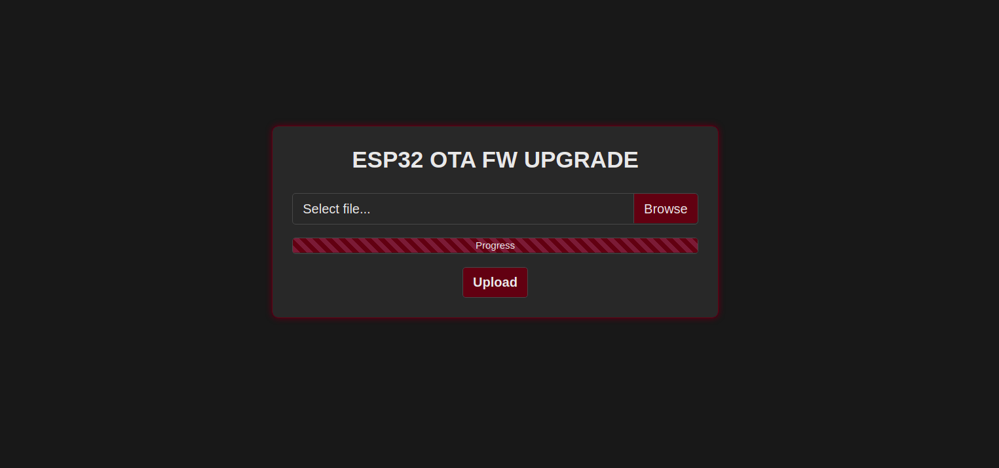

Description
===========
This is a simple ESP32 Arduino project template that allows Over The Air (OTA) upgrade from within WiFi network and doesn't get in the way of main code. I made a simple dark themed page with progress bar (see screenshot above).

**NOTE: The OTA upgrade code needs to be included in every Firmware(FW) you upload in order to keep the functionality, hence the idea for the non-invasive template.**

Main code is executed on core 1 (default), the same way any Arduino project is executed.

WiFi connection and Web server is started on core 0 so it's not affecting the main core's work. If WiFi is not connected, device will keep trying to connect. Once device connects to WiFi, it will print it's IP address on serial line.

**NOTE: If you use device in WiFi network without internet connectivity, OTA page interface will not look pretty, maybe won't even work at all. That's because it relies on jQuery and Bootstrap to work. May be fixed in next update.**

Web server endpoints:

Endpoint | Request | Description
-------- | ------- | -----------
http://<ESP32_IP>/ | GET | OTA upgrade page (requires basic autorization)
http://<ESP32_IP>/upgrade | POST | Used by OTA page to upload .bin file to device
http://<ESP32_IP>/esp32_present | GET | Check if device is accessible
http://<ESP32_IP>/fw_version | GET | Get current device FW version
http://<ESP32_IP>/process_command | POST | Send a command to device

**/process_command endpoint executes processCommand() function inside _MainCode.h_, if you want to also send commands to device through WiFi.**

Setup
=====

First you have to Add ESP32 Boards to Arduino IDE. There are a lot of examples for this, but here goes another:
1. Open Arduino IDE
1. Open **File->Preferences**, in *Additional Boards Manager URLs* field, add *https://raw.githubusercontent.com/espressif/arduino-esp32/gh-pages/package_esp32_index.json*
1. Open **Tools->Board->Boards Manager...**, search for **esp32** and click *Install*
1. In **Tools->Board** list, you should be able to select ESP32 based boards (my suggestion is *ESP32 Dev Module*, works for most ESP32 development boards)

For those like me that found it hard to get the ESP32 board to like the Arduino IDE, here are some tips:
* In **Tools->Board** list, select *ESP32 Dev Module*, works for most ESP32 development boards;
* Uploading FW for my board **didn't work using the _921600 baudrate_**, so **I'm using _460800_**, but if upload for your board still doesn't work, *continue lowering until upload works*;
* For partition scheme I like using *Minimal SPIFFS (1.9MB APP with OTA/190KB SPIFFS)*, but you can experiment freely, as long as you **don't select options with _No OTA_**.

Start
=====

Clone or download this repository and use Arduino IDE to open **ESP32_OTA.ino**.

This template makes it easy to separate main code from OTA upgrade code. You can just write your main code inside *MainCode.h* file, it will execute in the same way the code in *.ino* file is executed. In most cases there will be no need to edit *ESP32_OTA.ino* file.

First step is to upload FW to board using Arduino IDE (through serial connection).

Afterwards, you can build a *.bin* file with Arduino IDE (**Sketch->Export compiled Binary**) and upload it through the ESP32 OTA upgrade page.

Credits
=======

I like giving credit where credit is due, so here it goes:
* [Aleksandar Krsteski](https://github.com/acikabubo) - for providing the first ESP32 board I worked on, even before I bought my own

If I forget someone, just inform me and you'll be added immediately
